<!-- class: title -->


# Dockerを使う

---
<!-- class: slides -->
---
## dockerとは


---
## イメージ
  - Dockerコンテナを作成するための手順が書かれたテンプレート
  - 既存のイメージをもとにカスタマイズしたイメージを作成することもできる。
  - 

---
## コンテナ
  - 実行可能なイメージのインスタンス
  - 

---
## ネットワーク

---
## ボリューム

---
## 基本コマンド

Dockerを操作するにはdockerコマンドを使います。
dockerコマンドは、以下のような書式です。


**dockerコマンド使用例**

```shell
$ docker container run -dit --name my-apache -p 8080:80 -v "$PWD":/usr/local/apache2/htdocs/ httpd:2.4

$ docker container ps

$ docker container stop my-apache

$ docker container start my-apache
 ```

---
## コマンドの種類

dockerコマンドには下表のようなものがあります。
| コマンド | 概要 |
|---|---|
| run | 新しいコンテナを起動する。 |
| stop | コンテナを停止する。 |
| image | イメージに対する操作をする。 |
| container | コンテナに対する操作をする。 |

すべてのdockerコマンドについては以下を参照してください
https://docs.docker.com/engine/reference/commandline/docker/

---
## コンテナ起動から終了までの流れ


---
## Dockerコンテナ作成時のオプション

Dockerコンテナ作成時のオプションには下表のようなものがあります。

| オプション | 概要 |
|:--|:--|
| -p |  コンテナのポートをホストにpublishする。|
| -v | コンテナにボリュームをマウントする。 |
| -rm | コンテナが終了した時、自動的にコンテナを削除する。 |
| -e | コンテナの環境変数を設定する。 |

すべてのコンテナ作成時のオプションについては以下を参照してください
https://docs.docker.com/engine/reference/commandline/container_create/

---
## -pオプションによるポート設定

```sh
$ docker container run -dit --name my-apache01 -p 8080:80 -v "$PWD":/usr/local/apache2/htdocs/ httpd:2.4
$ docker container run -dit --name my-apache02 -p 8081:80 -v "$PWD":/usr/local/apache2/htdocs/ httpd:2.4
```



--- 

## -vオプションによるボリューム設定

```sh
$ docker container run -dit --name my-apache01 -p 8080:80 -v "$PWD":/usr/local/apache2/htdocs/ httpd:2.4
$ docker container run -dit --name my-apache02 -p 8081:80 -v "$PWD":/usr/local/apache2/htdocs/ httpd:2.4
```


---

## バインドマウントとボリュームマウント

### バインドマウント

ホスト上に作成したディレクトリをマウントする方法。

### ボリュームマウント

Docker Engine上で確保した領域をマウントする方法。
確保した場所のことを「データボリューム」もしくは「ボリューム」と呼ぶ。

---
## バインドマウント

```sh
$ cd /home/pi
$ mkdir my-data01

$ docker run -dit --name my-apl -v /home/pi/my-data01:/usr/local/apache2/htdocs -p 8080:80 httpd:2.4
```


---
## ボリュームマウント

```sh
$ docker volume create mysql-volume

$ docker run --name db01 -dit -v mysql-volume:/var/lib/mysql -e MYSQL_ROOT_PASSWORD=password mysql:5.7
```


---
## データボリューム

**docker volume**の操作

| 操作 | 概要 |
|:--|:--|
| create | ボリュームを作成する。 |
| inspect | ボリュームの詳細情報を確認する。 |
| ls | ボリューム一覧を参照する。 |
| purne | コンテナからマウントされていないボリュームを全て削除する。 |
| rm | ボリュームを削除する。 |

```sh
$ docker volume create --name my-volume
```

---
## ボリュームのバックアップ

```sh
$ docker run --rm -v mysqlvolume:/src -v "$PWD":/dest busybox tar czvf /dest/backup.tar.gz -C /src .
```


---
## ボリュームのリストア

```sh
$ docker volume create mysql-volume

$ docker container run --rm -v mysql-volume:/dest -v "$PWD":/src busybox tar xzf /src/backup.tar.gz -C /dest
```


---
## コンテナのマウント指定を引き継ぐ

`--volumes-from`オプションを使用することで、マウントするボリュームを個別ボリューム名を指定してマウントするのではなく、任意のコンテナがマウントしているディレクトリ名で指定できるようになります。コンテナのディレクトリが、どのボリュームにマウントされているかを意識する必要がありません。

```sh
$ docker run --rm --volumes-from db01 -v "$PWD":/dest busybox tar czf /dest/backup.tar.gz -C /var/lib/mysql .
```

---

## データボリュームコンテナ

必要なディレクトリだけをマウントしただけのコンテナ（データボリュームコンテナ）を使ってのバックアップ。

```sh
$ docker 
$ docker run --rm --volumes-from db01 -v "$PWD":/dest busybox tar czf /dest/backup.tar.gz -C /var/lib/mysql .
```

---
## mountオプションを使ったマウント

ボリュームのマウントには、 `-v` オプションを使ったマウントとは別に、 `-mount` オプションを使用する方法があります。

```sh
--mount type=マウントの種類,src＝マウント元,dst=マウント先
マウントの種類
bind ： バインドマウント
volume ： ボリュームマウント
tmpfs ： tmpfsマウント（メモリへのマウント）
```

以下理由から`-v` オプションより `-mount` の使用が推奨されています。

- `-v`はバインドマウントかボリュームマウントかわかりにくい
- `-v`はボリュームが存在しない時に新規にボリュームを作成する

---
## 規定の３つのネットワーク

- bridge
- host
- none

---
## bridgeネットワーク

- コンテナのネットワークは独立
- `-p`オプションでどのコンテナと通信するのかを決める


---
## bridgeネットワーク（コンテナに割り当てられるIP）

```sh
$ docker run -dit --name web01 -p 8080:80 httpd:2.4
$ docker run -dit --name web02 -p 8081:80 httpd:2.4

$ docker container inspect web01
[
    {
        "Id": "547f8f6d53f8456e28da1b163045128618596ae3e396acd4b7899966e4610f91",
          "Path": "httpd-foreground",
            ...
            "Networks": {
                "bridge": {
                    ...
                    "IPAddress": "172.17.0.2",
                    ...
        }
    }
]
```

---
## bridgeネットワーク（ネットワークに接続されているコンテナ）

```sh
$ docker run -dit --name web01 -p 8080:80 httpd:2.4
$ docker run -dit --name web02 -p 8081:80 httpd:2.4


$ docker network inspect bridge
[
        "Name": "bridge",
        "Containers": {
            "547f8f6d53f8456e28da1b163045128618596ae3e396acd4b7899966e4610f91": {
                "Name": "web01",
                "MacAddress": "02:42:ac:11:00:02",
                "IPv4Address": "172.17.0.2/16",
            },
            "42ae466d4f9e02abf4d9c89f3fe5514a82e5981187e5705df86020c9481f547f": {
                "Name": "web02",
                "MacAddress": "02:42:ac:11:00:03",
                "IPv4Address": "172.17.0.3/16",
```

---

## bridgeネットワークの仕組み

bridgeネットワークは、IPマスカレードを使って構成されています。
`docker run`や`docker create`の`-p`オプションは、IPマスカレードのポート転送設定を行っています。

※bridgeネットワークにIPマスカレードを使うか否かはDocker Engineの実装次第です。

---
## Dockerネットワークの作成

```sh
$ docker network create my-docker-net

$ docker network ls

$ docker network inspect my-docker-net
```

---
## Dockerネットワークにコンテナを接続

---
## hostネットワーク

---
## noneネットワーク

---
## Docker-compose

---
## Dockerイメージの自作
