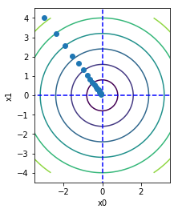

# ゼロから作るDeepLearning 学習ノート

---

## 前提

この学習ノートでは以下列挙する事項を前提とする。

- 行列計算を習った記憶がわずかにあること。
- サンプルコードとしてPythonを使用する。
  - プログラムの雰囲気がわかればよい。
  - 行列計算にnumpyといライブラリを使う。
- 結局は役に立たない。
  - tensorflowなどのライブラリがやる。
  - 今回はtensorflow使わない。

---

## Contens

1. パーセプトロン
1. ニューラルネットワーク
1. ニューラルネットワークの学習
1. 逆誤差伝播方式
1. 学習に関するテクニック
1. 畳み込みニューラルネットワーク
1. ディプラーニング

---

## パーセプトロン

---

### パーセプトロンとは

パーセプトロンは、複数の信号を入力として受け取り、ひとつの信号を出力する。

例：２つの入力を受け取るパーセプトロン。


$$
y =
  \begin{cases}
    0 & (w_1 x_1 + w_2 x_2 + b<= 0)\\
    1 & (w_1 x_1 + w_2 x_2 + b>  1)
  \end{cases}
$$

---

#### パセープトロンで使用する変数

$$
y =
  \begin{cases}
    0 & (w_1 x_1 + w_2 x_2 + b<= 0)\\
    1 & (w_1 x_1 + w_2 x_2 + b>  1)
  \end{cases}
$$

変数|説明
:--|:--
$x_1$, $x_2$ | 入力値
$w_1$, $w_2$ | 各入力値に対する重み
$b$| 出力値を決定するための閾値
$y$ | 出力値

---

### 簡単な実装（ORゲート）

$w_1 = 0.5$, $w_2 = 0.5$, $b = -0.2$の重みを持つパーセプトロンで、ORゲートを実現できる。

$$
y =
  \begin{cases}
    0 & (0.5 x_1 + 0.5 x_2 - 0.2 <= 0)\\
    1 & (0.5 x_1 + 0.5 x_2 - 0.2 >  1)
  \end{cases}
$$

$x_1$ | $x_2$ | $y$ | |
--:|--:|--:|--:
0 | 0 | 0 | (-0.2)
0 | 1 | 1 | ( 0.3)
1 | 0 | 1 | ( 0.3)
1 | 1 | 1 | ( 0.8)

---

#### パーセプトロンの実装イメージ（ORゲート）

```python
def OR(x1, x2):
    x = np.array([x1, x2])
    w = np.array([0.5, 0.5])
    b = -0.2
    tmp = np.sum(w * x) + b
    if tmp <= 0:
        return 0
    else:
        return 1
```

#### 実行結果（ORゲート）

```python
print(OR(0, 0)) -> 0
print(OR(0, 1)) -> 1
print(OR(1, 0)) -> 1
print(OR(1, 1)) -> 1
```

---

### 簡単な実装（ANDゲート）

$w_1 = 0.5$, $w_2 = 0.5$, $b = -0.7$の重みを持つパーセプトロンで、ANDゲートを実現できる。

$$
y =
  \begin{cases}
    0 & (0.5 x_1 + 0.5 x_2 - 0.7 <= 0)\\
    1 & (0.5 x_1 + 0.5 x_2 - 0.7 >  1)
  \end{cases}
$$

$x_1$ | $x_2$ | $y$ | |
--:| --:|--:|--:
 0 |  0 | 0 | (-0.7)
 0 |  1 | 0 | (-0.2)
 1 |  0 | 0 | (-0.2)
 1 |  1 | 0 | ( 0.3)

---

#### パーセプトロンの実装イメージ（ANDゲート）

```python
def AND(x1, x2):
    x = np.array([x1, x2])
    w = np.array([0.5, 0.5])
    b = -0.7
    tmp = np.sum(x * w) + b
    if tmp <= 0:
        return 0
    else:
        return 1
```

#### 実行結果（ANDゲート）

```python
print(AND(0, 0)) -> 0
print(AND(0, 1)) -> 0
print(AND(1, 0)) -> 0
print(AND(1, 1)) -> 1
```

---

### 簡単な実装（NANDゲート）

$w_1 = -0.5$, $w_2 = -0.5$, $b = 0.7$の重みを持つパーセプトロンで、NANDゲートを実現できる。

$$
y =
  \begin{cases}
    0 & (-0.5 x_1 - 0.5 x_2 + 0.7 <= 0)\\
    1 & (-0.5 x_1 - 0.5 x_2 + 0.7 >  1)
  \end{cases}
$$

$x_1$ | $x_2$| $y$ ||
--:|--:|--:|--:
0 | 0 | 1 | ( 0.7)
0 | 1 | 1 | ( 0.2)
1 | 0 | 1 | ( 0.2)
1 | 1 | 0 | (-0.3)

---

#### パーセプトロン実装イメージ（NANDゲート）

```python
def NAND(x1, x2):
    x = np.array([x1, x2])
    w = np.array([-0.5, -0.5])
    b = 0.7
    tmp = np.sum(w * x) + b
    if tmp <= 0:
        return 0
    else:
        return 1
```

#### 実行結果（NANDゲート）

```python
print(NAND(0, 0)) -> 1
print(NAND(0, 1)) -> 1
print(NAND(1, 0)) -> 1
print(NAND(1, 1)) -> 0
```

---

### パーセプトロンの特徴

- 重みをの値を変更するだけで、様々な表現をすることができる。
- 論理回路を使った例では、入力が２信号だけだったが、もっとたくさんの入力信号があっても良い。１００でも２００でも。

---

### 簡単な実装？（XORゲート）

XORゲートは下表のような論理回路となる。

$x_1$ | $x_2$ | $y$
--:|--:|--:
0 | 0 | 0
0 | 1 | 1
1 | 0 | 1
1 | 1 | 0

これを実現するパーセプトロンの重み$w_1$, $w_2$,や閾値$b$にはどのような値を用意すればよいか。

---

#### パーセプトロンで表現できない非線形

パーセプトロンでは、XORゲートを表現できない。
パーセプトロンは、１本の直線で領域を分離可能なものを表現できるが、そうでないものを表現できない。
 


---

#### 多層パーセプトロンによる実現(XOR)

ひとつのパーセプトロンでXORゲートを表現できなくても、これまでに作成したNANDゲート、ORゲート、ANDゲートを組み合わせればXORゲートも表現可能。


---

#### 多層パーセプトロン実装イメージ(XORゲート)

```python
def XOR(x1, x2):
    s1 = NAND(x1, x2)
    s2 = OR(x1, x2)
    y = AND(s1, s2)
    return y
```

#### 実行結果（XORゲート）

```python
print(XOR(0, 0)) -> 0
print(XOR(0, 1)) -> 1
print(XOR(1, 0)) -> 1
print(XOR(1, 1)) -> 0
```

---

### まとめ

- パーセプトロンは、ある入力を与えると決まった値が出力される。
- パーセプトロンは、「重み」と「閾値」をパラメータとして設定する。
- 単層のパーセプトロンは線形領域だけしか表現できない。
- 多層のパーセプトロンでは非線形領域を表現することができる。
- 論理回路を表現できれば大量のパーセプトロンで、パソコンでできることは全てできるはず…

---

## ニューラルネットワーク

---

### パーセプトロンの復習

パーセプトロンは下図・下式のようなものだった。


$$
y =
  \begin{cases}
    0 & (w_1 x_1 + w_2 x_2 + b <= 0) \\
    1 & (w_1 x_1 + w_2 x_2 + b >  1)
  \end{cases}
$$

---

### 活性化関数

パーセプトロンを２式に分解する。

「入力信号の総和を求める部分」
$$a = w_1 x_1 + w_2 x_2 + b$$

「総和から出力値を求める部分」
$$y = h(a)$$

$h(x)$を活性化関数と呼ぶ。
活性化関数にはステップ関数やシグモイド関数、ReLU関数などがある。

---

#### 活性化関数（ステップ関数）

パーセプトロンで使用していた活性化関数。
入力値が$0$より大きければ$１$を、入力値が$0$以下であれば$0$を出力する。

$$
h(x) = \begin{cases}
    1 & (x >  0) \\
    0 & (x \leq 0)
  \end{cases}
$$


---

#### 活性化関数（シグモイド関数）

ニューラルネットワークで使われる関数のひとつ。
出力値が$0$〜$1$の間の滑らかな曲線を描く。
$$
h(x) = \frac{1}{1 + \text{exp(-x)}}
$$


<!--
式中の$exp(-x)$は、$e^{-x}$を意味する($e$はネイピア数の実数$2.7182...$を表す)。
パーセプトロンとニューラルネットワークの違いは、活性化関数にステップ関数を使用しているか、シグモイド関数を使用しているかの差だけ。
-->

---

#### 活性化関数（ReLU関数）

デーィプラーニグで用いられる関数のひとつ。
入力値が$0$より大きければ入力値を、入力値が$0$以下であれば$0$を出力する。

$$
h(x) = \begin{cases}
    x & (x > 0) \\
    0 & (x \leq 0)
  \end{cases}
$$


<!--シグモイド関数は、ニューラルネットワークの歴史において古くから利用されていた。現在では、ReLU関数(Rectified Linear Unit)が利用されることが多い。-->

---

#### 活性化関数(tanh関数)

ディープラーニングで用いられる関数のひとつ。

$$
h(x) = \frac {\text{sinh}(x)}{\text{cosh}(x)} = \frac {e^x - e^{-x}}{e^x + e^{-x}}
$$


---

#### 活性化関数(実装)

```python
# ステップ関数
def step_function(x) ：
    return np.array(x > 0, dtype=npint)
```

```python
# シグモイド関数
def sigmoid(x) :
    return 1 / (1 + np.exp(-x))
```

```python
# ReLU関数
def relu(x) :
    return np.maximum(0, x)
```

```python
# tanh関数
def tanh(x) :
    return np.tanh(x)
```

---

#### 活性化関数(シグモイド関数の使用理由)


ニューラルネットワークで活性化関数にシグモイド関数を使用するのは、シグモイド関数が入力値に対して連続的に出力値が変化する性質を持つため。

この滑らかさが、ニューラルネットワークの学習において重要な意味を持つ。

---

### ３層ニューラルネットワーク

入力信号が２つ($x_1$と$x_2$)、隱れ層が２層、出力信号が２つ($y_1$と$y_2$)の３層ニューラルネットワークのイメージを下に示す。


---

#### ３層ニューラルネットワーク(変数のお約束)

３層ニューラルネットワークの計算をみる前に、変数の添字ルールを決める。

変数 | 意味
---|---
$x_n$      | $n$個目の入力値
$w^i_{nm}$ | $i-1$層目$m$個目から $i$層目$n$個目への重み
$b^i_{n}$  | $i$層目$n$個目の閾値
$a^i_n$    | $i$層目$n$個目の入力値総和
$z^i_n$    | $i$層目$n$個目の出力値
$y_n$      | $n$個目の出力値

---

#### ３層ニューラルネットワーク(隱れ層①)

入力層からの入力から隱れ層①の出力値を計算。


$$
\begin{aligned}
a^1_1 &= w^1_{11} x_1 + w^1_{12} x_2 + b^1_1 & z^1_1 &= h(a^1_1)\\
a^1_2 &= w^1_{21} x_1 + w^1_{22} x_2 + b^1_2 & z^1_2 &= h(a^1_2)\\
a^1_3 &= w^1_{31} x_1 + w^1_{32} x_2 + b^1_3 & z^1_2 &= h(a^1_3)
\end{aligned}
$$

---

#### ３層ニューラルネットワーク(隱れ層②)

隱れ層①からの入力から隱れ層②の出力値を計算。


$$
\begin{aligned}
a^2_1 &= w^2_{11} z^1_1 + w^2_{12} z^1_2 + w^2_{13} z^1_3 + b^2_1 & z^2_1 = h(a^2_1) \\
a^2_2 &= w^2_{21} z^1_2 + w^2_{22} z^1_2 + w^2_{23} z^1_3 + b^2_2 & z^2_2 = h(a^2_2)
\end{aligned}
$$

---

#### ３層ニューラルネットワーク(出力層)

隱れ層②からの入力受けて出力層での結果を計算
活性化関数は、隱れ層と 異なる関数$f(x)$を使用。


$$
\begin{aligned}
a^3_1 &= w^3_{11} z^2_1 + w^3_{12} z^2_2 + b^1_1 & y_1 = f(a^3_1) \\
a^3_2 &= w^3_{21} z^2_1 + w^3_{22} z^2_2 + b^1_2 & y_2 = f(a^3_2)
\end{aligned}
$$

---

#### ３層ニューラルネットワーク(まとめ)


計算内容が難しそうに見えるけれども、３つのことを繰り返しているだけ。

- １つ前層の出力値（入力値）に重みを掛ける
- 重みを掛けたものと閾値の総和を求める
- 活性化関数で出力値を求める。

---

### 出力層の活性化関数

出力層の活性化関数は、ニューラルネットワークを使用する目的に合わせて使い分ける。

- 回帰問題
  - 入力データから数値の予測を行う。
  - 恒等関数を活性化関数として使用。
- 分類問題
  - データがどの分類に所属するかを判断する。
  - Softmax関数を活性化関数として使用。

---

#### 出力層の活性化関数(恒等関数)

入力値がそのまま出力値となる関数。

$$
f(x) = x
$$

---

#### 出力層の活性化関数(Softmax関数)

出力値の総和を分母に、特定の出力値の分子として、特定の出力値がもつ割合を求める関数。

$$
f(x) = \frac {\text{exp}(a_k)}{\sum^n_{i=1} \text{exp}(a_i)}
$$

$\text{exp}(a_k)$がコンピュータでの計算ではオーバーフローを起こす可能性があるため式の改善をおこなう。

$$
f(x) = \frac {\text{exp}(a_k - C')}{\sum^n_{i=1} \text{exp}(a_i - C')}
$$

$C'$には$a_k$のなかで最大の値を使用するのが一般的。

---

#### 出力層の活性化関数(実装)

```python
# 恒等関数
def identity_function(x):
    y = x
    return y
```

```python
# ソフトマックス関数
def softmax(x):
    c = np.max(x)
    exp_x = np.exp(x - c)
    sum_exp_x = np.sum(exp_x)
    y = exp_x / np.sum(sum_exp_x)
    return y
```

---

### 行列式

簡単なニューラルネットワークでも、計算式を記述していくと大変そうに見えるてた。
行列式の力を借りて、計算式をシンプルにする。

使うのは４つだけ。

- 行列
- 足し算
- 掛け算(内積)
- 転置

---

#### 行列式（行列）

まずは、１次元行列、２次元行列を導入する。

１次元行列(プログラム的には１次元配列)

$$
X =
\left(
\begin{array}{cccc}
x_1 & x_2 & \cdots & x_n
\end{array}
\right)
$$

２次元行列(プログラム的には２次元配列)

$$
W =
\left(
\begin{array}{cccc}
w_{11} & w_{21} & \cdots & w_{n1} \\
w_{12} & w_{22} & \cdots & w_{n2} \\
\vdots & \vdots & \ddots& \vdots \\
w_{1m} & w_{2m} & \cdots & w_{nm} \\
\end{array}
\right)
$$

---

#### 行列式(足し算)

行列と行列の足し算(素直に足すだけ)

$$
\left( \begin{array}{r} 1 \\ 2 \\ 3 \\ 4 \end{array} \right) +
\left( \begin{array}{r} 5 \\ 6 \\ 7 \\ 8 \end{array} \right) =
\left( \begin{array}{r} 1 + 5 \\ 2 + 6 \\ 3 + 7 \\ 4 + 8 \end{array} \right) =
\left( \begin{array}{r} 6 \\ 8 \\ 10 \\ 12 \end{array} \right)
$$

---

#### 行列式（掛け算：内積）

１次元行列と２次元行列の内積

$$
\begin{aligned}
    XW &=
        \left(
            \begin{array}{rr}
                x_1 & x_2
            \end{array}
        \right)
        \left(
            \begin{array}{rrr}
                w_{11} & w_{21} & w_{31} \\
                w_{12} & w_{22} & w_{32}
            \end{array}
        \right)
    \\
    &=
        \left(
            \begin{array}{rrr}
                a_1 & a_2 & a_3
            \end{array}
        \right)
\end{aligned}
$$

$a_1$,$a_2$,$a_3$の内容
$$
\begin{aligned}
    a_1 &= x_1*w_{11}+x_2*w_{12} \\
    a_2 &= x_1*w_{21}+x_2*w_{22} \\
    a_3 &= x_1*w_{31}+x_2*w_{32}
\end{aligned}
$$

---

#### 行列式(転置)

行列の行と列を入れ替え。

$$
\begin{aligned}
    W &=
        \left(
            \begin{array}{lll}
                w_1 & w_2 & w_3 \\
                w_4 & w_5 & w_6
            \end{array} \right)
    \\
    \\
    W^{\mathrm{T}} &=
        \left(
            \begin{array}{lll}
                w_1 & w_4 \\
                w_2 & w_5 \\
                w_3 & w_6
            \end{array}
        \right)
\end{aligned}
$$

---

### ３層ニューラルネットワーク②


入力信号が２つ、隱れ層を２層、出力信号が２つの簡単なニューラルネットワークを行列式で表現していく。

---

#### ３層ニューラルネットワーク②-1

入力信号は１次元行列

$$
X =
    \left(
        \begin{array}{ll}
            x_1 & x_2
        \end{array}
    \right)
$$

入力層と隱れ層①間の重みは２次元配列
$$
W^1 =
    \left(
        \begin{array}{lll}
            w^1_{11} & w^1_{21} & w^1_{31}\\
            w^1_{12} & w^1_{22} & w^1_{32}
        \end{array}
    \right)
$$

隱れ層①の閾値は１次元配列
$$
B^1 =
    \left(
        \begin{array}{lll}
            b^1_1 & b^1_2 & b^1_3
        \end{array}
    \right)
$$

---

#### ３層ニューラルネットワーク②-2

隱れ層①の入力信号の総和は下式。

$$
\begin{aligned}
    A^1 &= X W^1 + B^1
    \\
    &=
        \left(
            \begin{array}{rr}
                x_1 & x_2
            \end{array}
        \right)
        \left(
            \begin{array}{ll}
                w^1_{11} & w^1_{12} \\
                w^1_{21} & w^1_{22} \\
                w^1_{31} & w^1_{32}
            \end{array}
        \right)^{\mathrm{T}}
        +
        \left(
            \begin{array}{l}
                b^1_1 \\
                b^1_2 \\
                b^1_3
            \end{array}
        \right)^{\mathrm{T}}
    \\
    &=
        \left(
            \begin{array}{lll}
                x_1*w^1_{11}+x_2*w^1_{12}+b^1_1 \\
                x_1*w^1_{21}+x_2*w^1_{22}+b^1_2 \\
                x_1*w^1_{31}+x_2*w^1_{32}+b^1_3
            \end{array}
        \right)^{\mathrm{T}}
    \\
    &=
        \left(
            \begin{array}{lll}
                a^1_1 & a^1_2 & a^1_3
            \end{array}
        \right)
\end{aligned}
$$

---

#### ３層ニューラルネットワーク②-3

隱れ層①の出力信号は下式。

$$
\begin{aligned}
    Z^1 &= h(A^1)
    \\
    &=
        \left(
            \begin{array}{lll}
                h(a^1_1) & h(a^1_2) & h(a^1_3)
            \end{array}
        \right)
    \\
    &=
        \left(
            \begin{array}{lll}
                z^1_1 & z^1_2 & z^1_3
            \end{array}
        \right)
\end{aligned}
$$

---

#### ３層ニューラルネットワーク②-4

隱れ層②や出力層についても同じように計算する。
式を記載すると下式のようになる。

層| 計算式
---|---
入力層 | $X$
隱れ層① | $\begin{aligned}A^1 &= X W^1 + B^1 \\Z^1 &= h(A^1)\end{aligned}$
隱れ層② | $\begin{aligned}A^2 &= Z^1 W^2 + B^2 \\Z^2 &= h(A^2)\end{aligned}$
出力層 | $\begin{aligned}A^3 &= Z^2 W^3 + B^3 \\Y &= f(A^3)\end{aligned}$

---

#### ３層ニューラルネットワーク②-5

整理すると２種類の計算式で成り立っている。

計算内容 | 計算式 | 名前
---|---|---
入力信号総和 | $A = X W +B$ | Affine
活性化関数 | $Y = f(A)$ | Sigmoid ,Softmax


---

### 文字認識

ニューラルネットワークで文字認識をやってみる。

---

#### 文字認識(入力層)

入力信号には、MNINTのデータを使用する。

MNINTの文字画像は、$28*28$のグレースケール。

2次元データを１次元に変換して入力信号にする。

入力層のニューロン数は$784(= 28 * 28)$となる。

---

#### 文字認識(出力層)

MNISTの文字画像は、数字の$0$〜$9$に対応する。

出力層は、$0$〜$9$に対応する10のニューロンで構成。

これは分類問題となる。

結果出力層の関数には、Softmax関数を使う。

---

#### 文字認識(ニューラルネットワークの構造)


層名|ニューロン数 | 備考
---|--:|---
入力層 | $784$ | 画像サイズ$(28 \times 28)$
隱れ層① | 50 | 適当
隱れ層② | 100 | 適当
隱れ層③ | 100 | 適当
出力層 | $10$ | 分類数($1$〜$10$)に対応

---

#### 文字認識(計算式)

層名|計算式
:--|:--
入力層|$X$
隱れ層①|$\begin{aligned}A^1 &= X W^1 + B^1 \\Z^1 &= \text{Sigmoid}(A^1)\end{aligned}$
隱れ層②|$\begin{aligned}A^2 &= Z^1 W^2 + B^2 \\Z^2 &= \text{Sigmoid} (A^2)\end{aligned}$
隱れ層③|$\begin{aligned}A^3 &= Z^2 W^3 + B^3 \\Z^3 &= \text{Sigmoid} (A^3)\end{aligned}$
出力層|$\begin{aligned}A^4 &= Z^3 W^4 + B^4 \\Y &= \text{Softmax} (A^4)\end{aligned}$

---

#### ニューラルネットワークで文字認識(実装)

実装を簡略に記載すると以下のようになる。

```python
# 認識させる文字の読み込み
train_x = load_mnist()
x = tain_x[0]
# 隱れ層①
a1 = np.dot(x, w1) + b1
z1 = sigmoid(a1)
# 隱れ層②
a2 = np.dot(z1, w2) + b2
z2 = sigmoid(a2)
# 隱れ層③
a3 = np.dot(z2, w3) + b3
z3 = sigmoid(a3)
# 出力層
a4 = np.dot(z3, w4) + b4
y = softmax(a4)
```

---

#### ニューラルネットワークで文字認識(実行結果1)

入力データに下図を使って、先のニューラルネットークを実行。


---

#### ニューラルネットワークで文字認識(実行結果2)

ニューラルネットワークは、以下のような答えを出力した。

```python
0である可能性 : 10.09%
1である可能性 :  2.95%
2である可能性 : 17.71%
3である可能性 :  5.65%
4である可能性 :  7.49%
5である可能性 :  7.14%
6である可能性 :  6.91%
7である可能性 : 10.63%
8である可能性 : 27.53%
9である可能性 :  3.83%
```

---

#### ニューラルネットワークで文字認識(実行結果3)


$5$が、$5$である可能性は$7.14%$、$8$である可能性は$27%$と言う結果となった。

重みも、閾値も調整していないニューラルネットワークから、正しい答えは得られない。

重みや閾値を学習し調整する仕組みは次章で考える。

---

### まとめ(ニューラルネットワーク)

- ニューラルネットワークでは、活性化関数にシグモイド関数やReLU関数を使う。
- ニュラールネットワークで回帰問題を扱う場合は出力関数に恒等関数を使う。
- ニューラルネットワークで分類問題を扱う場合は出力関数にソフトマックス関数を使う。

<!--
- 入力データのまとまりをバッチといい、バッチ単位で推論処理を行うことで計算を高速で行うことができる。
-->

---

## ニューラルネットワークの学習

---

### 損失関数

ニューラルネットワークの性能の悪さを示す指標。
出力値と想定結果がどれだけ一致していないかを表す。

損失関数の結果が最小となるパラメータを探索する行為が、ニューラルネットワークの学習となる。

ニューラルネットワークでは、損失関数に２乗和誤差や交差エントロピー誤差を用いる。

---

#### 損失関数(２乗和誤差)

２乗和誤差は下式のように表される。

$$
E = \frac {1}{2} \sum_k (y_k - t_k)^2
$$

変数|説明
:--|:--
$y_k$ | ニューラルネットワークの出力値
$t_k$ | 想定結果

---

#### 損失関数(２乗和誤差：実装)

```python
# ２乗和誤差
def mean_squared_error(y, t):
    return 0.5 * np.sum((y-t)**2)
```

```python
# "2"を正解とする。
t = np.array([0,0,1,0,0,0,0,0,0,0])

# "2"である確率が一番高いとなった場合。
y = np.array([0.1,0.05,0.6,0.0,0.05,0.1,0.0,0.1,0.0,0.0])
mean_squared_error(y, t)
-> .09750000000000003

# "7"である確率が一番高いとなった場合。
y= np.array([0.1,0.5,0.1,0.0,0.05,0.1,0.0,0.6,0.5,0.0])
mean_squared_error(y, t)
-> 0.8462500000000001
```

---

#### 損失関数(交差エントロピー誤差)

交差エントロピー誤差は下式のように表される。

$$
E = - \sum_k t_k \text{log} y_k
$$

変数|説明
:--|:--
$y_k$ | ニューラルネットワークの出力
$t_k$ | 教師データ

---

#### 損失関数(交差エントロピー誤差：実装)

```python
# 交差エントロピー誤差
def cross_entropy_error(y, t):
    delta = 1e-7 # log(0)=-Inf(無限大)とならないようにする
    return -np.sum(t * np.log(y + delta))
```

```python
# "2"を正解とする。
t = np.array([0,0,1,0,0,0,0,0,0,0])

# "2"である確率が一番高いとなった場合。
y = np.array([0.1,0.05,0.6,0.0,0.05,0.1,0.0,0.1,0.0,0.0])
cross_entropy_error(y, t)
-> 0.510825457099338

# "7"である確率が一番高いとなった場合。
y= np.array([0.1,0.5,0.1,0.0,0.05,0.1,0.0,0.6,0.5,0.0])
cross_entropy_error(y, t)
-> 2.302584092994546
```

---

### 微分

ある瞬間の変化の量を表したもの。
数式では次のように表される。

$$
\frac {df(x)}{dx}= \lim_{h \to 0} \frac{f(x + h) - f(x - h)}{2h}
$$

この式は中心差分と呼ばれ、$x$地点を中心とした$\pm{h}$地点の$f(x)$の結果から$x$地点の変化量を求める式となる。

$f(x)$の計算結果から微分を求める方法を数値微分と呼ぶ。

---

#### 微分(数値微分：計算例)

下式に対する$x=5$地点の数値微分を求めてみる。
なお、$h=0.0001$とする。

$$
f(x) = 0.001 x^2 + 0.1x
$$

$$
\begin{aligned}
\frac {df(x)}{dx} &= \frac{f(x + h) - f(x - h)}{2h} \\
&= \frac{f(5.0001) - f(4.9999)}{0.0002} \\
& = 0.1999999999990898
\end{aligned}
$$

$f(x)$の$x=5$地点の変化量は約$0.199$。

---

#### 微分(数値微分：実装)

```python
def numerical_diff(f, x):
    h = 1e-4 # 0.0001
    return (f(x+h) - f(x-h)) / (2*h)
```

```python
def function_1(x):
    return (0.01 * (x **2)) + (0.1 * x)

numerical_diff(function_1, 5)
->0.1999999999990898

numerical_diff(function_1, 15)
->0.4000000000026205

numerical_diff(function_1, -10))
->-0.0999999999995449
```

---

#### 微分(数値微分：イメージ)

$f(x)=0.001 x^2 + 0.1$と$x=\left( -10, 5, 15\right)$地点の微分の結果をグラフにすると下図のようになる。

$x=-10$ | $x = 5$ | $x = 15$
---|---|---
||

---

#### 微分(偏微分)

複数の変数からなる関数の微分のこと。

$$
f(x_0, x_1) = x_0^2 + x_1^2
$$

の偏微分を式で表すと$\frac{\delta{f}}{\delta{x_0}}$, $\frac{\delta{f}}{\delta{x_1}}$のようになる。

$y = x_0^2 + x_1^2$をグラフにすると下図のようになる。


---

#### 微分(偏微分：計算①)

$f(x_0, x_1) = x_0^2 + x_1^2$の式で、$(x_0, x_1) = (3, 4)$のときの偏微分を求める。

$$
\begin{aligned}
f(x_0, x_1=4) &= x_0^2+ 4^2 \\

f'(x_0) &=  x_0^2+ 16
\end{aligned}
$$

$$
\begin{aligned}
\frac {\delta{f'(x_0)}}{\delta{x_0}} &= \frac{f'(x_0 + h) - f'(x_0 - h)}{2h} \\
& = \frac{f'(3.0001) - f'(2.9999)}{0.0002} \\
\frac {\delta{f}}{\delta{x_0}} & = 6.00000000000378
\end{aligned}
$$

---

#### 微分(偏微分：計算②)

$f(x_0, x_1) = x_0^2 + x_1^2$の、$(x_0, x_1) = (3, 4)$のときの偏微分を求める。

$$
\begin{aligned}
f(x_0 = 3, x_1) &= 3^2 + x_1^2 \\

f''(x_1) &=  9+ x_1^2
\end{aligned}
$$

$$
\begin{aligned}
\frac {\delta{f''(x_1)}}{\delta{x_1}} &= \frac{f''(x_1 + h) - f''(x_1 - h)}{2h} \\
& = \frac{f''(4.0001) - f''(3.9999)}{0.0002} \\
\frac {\delta{f}}{\delta{x_1}} & = 7.999999999999119
\end{aligned}
$$

---

#### 微分(偏微分：計算③)

以上より、

$$
f(x_0, x_1) = x_0^2 + x_1^2
$$

上式の$(x_0, x_1)=(3, 4)$時点の偏微分は、

$$
\begin{aligned}
\frac {\delta{f}}{\delta{x_0}} & = 6.00000000000378 \\ \\
\frac {\delta{f}}{\delta{x_1}} & = 7.999999999999119
\end{aligned}
$$

となる。

---

#### 微分(偏微分：実装)

```python
# 数値微分（中心差分)
def numerical_diff(f, x):
    h = 1e-4 # 0.0001
    return (f(x+h) - f(x-h)) / (2*h)
# f(x)=x0^2+x1^2 におけるx1=4となる時の関数
def function_tmp1(x0):
    return x0**2.0 + 4.0 ** 2.0
# f(x)=x0^2+x1^2 におけるx0=3となる時の関数
def function_tmp2(x1):
    return 3.0 ** 2.0 + x1**2.0
```

```python
numerical_diff(function_tmp1, 3.0)
-> 6.00000000000378

numerical_diff(function_tmp2, 4.0)
-> 7.999999999999119
```

---

### 勾配

すべての変数の偏微分をベクトルとしてまとめたものを勾配という。

たとえば、
$$
f(x_0, x_1) = x_0^2 + x_1^2
$$
に置ける$(3, 4)$点の勾配は
$$
(\frac{\delta{f}}{\delta{x_0}}, \frac{\delta{f}}{\delta{x_1}}) = (6, 8)
$$
となる。

---

#### 勾配(実装①)

```python
def _numerical_gradient(f, x) :
    h = 1e-4
    grad = np.zeros_like(x)
    for idx in range(x.size) :
        tmp_val = x[idx]
        # f(x + h)の計算
        x[idx] = tmp_val + h
        fxh1= f(x)
        # f(x -　h)の計算
        x[idx] = tmp_val - h
        fxh2 = f(x)

        grad[idx] = (fxh1 - fxh2) / (2 * h)
        x[idx] = tmp_val
    return grad
```

---

#### 勾配(実装②)

```python
def numerical_gradient(f, X):
    grad = np.zeros_like(X)

    for idx, x in enumerate(X):
        grad[idx] = _numerical_gradient(f, x)

    return grad
```

```python
# ^ sum(x[i]^2)
def function_2(x) :
    return np.sum(x**2)

_numerical_gradient(function_2, np.array([3.0, 4.0]))
-> array([6., 8.])

_numerical_gradient(function_2, np.array([0.0, 2.0]))
->array([0., 4.])
```

---

#### 勾配(イメージ)

$f(x_0, x_1)=x_0^2+x_1^2$ | $(\frac {\delta{f}}{\delta{x_0}}, \frac{\delta{f}}{\delta{x_1}})$
---|----
|

勾配は、$f(x_0, x_1)$の「一番低い場所（最小値）」を指す。

---

### 勾配法

勾配を用いて関数の最小値を探索する方法を勾配降下法という（最大値を探索する場合は勾配上昇法）。

勾配法を式で表すと下式のようになる。

$$
\begin{aligned}
x &= x - \eta \frac {\delta f}{\delta x} \\
\end{aligned}
$$

$\eta$は学習率(LearningRate)とよび任意の数値が使われる。$\eta$は大きすぎても小さすぎても最小値への到達が難しくなる。

---

#### 勾配法(実装例：変数１つ）

```python
def numerical_diff(f, x):
    h = 1e-4 # 0.0001
    return (f(x+h) - f(x-h)) / (2*h)

def function(x):
    return (0.01 * (x ** 2)) + (0.1 * x)
```

```python
lr = 0.001
x = 0

for i in range(200000):
    diff = numerical_diff(function, x)
    new_x = x - lr * diff
    if  i % 10000 == 0 :
        print(str(i) + ":" + str(x) )
    x = new_x
```

---

#### 勾配法（処理結果：変数１つ）

```python
     0: 0                 ,  0.0
 10000:-1.648426583231277 , -0.1376695563200923
 20000:-2.753391126403293 , -0.19952748569076534
 30000:-3.4940650842766314, -0.22732160029605256
 40000:-3.9905497138164314, -0.2398101011972391
.
.
.
120000:-4.958855214948994 , -0.2499830710666311
130000:-4.972420046436861 , -0.24999239346161456
140000:-4.981512752160442 , -0.24999658221667317
150000:-4.987607726318238 , -0.24999846431552997
```

試行を繰り返すたびに$f(x)$が最小となる$x$に近いている。

---

#### 勾配法(変数２つ①)

変数が２つの時の勾配法はどのようになるのか。

下式を前提に考える。

$$
f(x_0, x_1) = x_0^2 + x_1^2
$$

勾配法の考え方は変数が１つのときと同じ

$$
\begin{aligned}
x_0 &= x_0 - \eta \frac {\delta f}{\delta x_0} \\
x_1 &= x_1 - \eta \frac {\delta f}{\delta x_1}
\end{aligned}
$$

---

#### 勾配法(変数２つ②)

$f(x_0, x_1) = x_0^2 + x_1^2$のグラフ、ならびに、勾配は下図のようなものだった。

$f(x_0, x_1)=x_0^2+x_1^2$ | $(\frac {\delta{f}}{\delta{x_0}}, \frac{\delta{f}}{\delta{x_1}})$
---|----
|

---

#### 勾配法(変数２つ③)

$f(x_0, x_1) = x_0^2 + x_1^2$対し$(x_0,x_1)=(-3, 4)$を初期値として勾配法を用いると下図のような軌跡で、$f(x_0, x_1)$の最小値点に近く。



---

### ニューラルネットワークの学習方法

ニューラルネットワークの学習は、勾配法を使って重み$W$や閾値$B$を調整しながら損失関数の結果を最小化することで行う。

<!--簡単にいうと、間違った結果を出力しにくいニューラルネットワークとなるように学習させる。-->

$$
\begin{aligned}
W & = W - \eta{\frac{\delta{L}}{\delta{W}}} \\ \\
B & = B - \eta{\frac{\delta{L}}{\delta{B}}}
\end{aligned}
$$

$L$：ニューラルネットワークの損失関数

---

#### ニューラルネットワークの学習方法(計算式①)

下記ニューラルネットワークの学習を表記する。


---

#### ニューラルネットワークの学習方法(計算式②)

層名 | 計算式 | 学習式
:--|:--|:--
入力層 | $X$ | -
隱れ層①|$\begin{aligned}A^1 &= X W^1 + B^1 \\Z^1 &= \text{f}(A^1)\end{aligned}$ | $\begin{aligned}W^1 &= W^1 - \eta{\frac{\delta{L}}{\delta{W^1}}} \\ B^1 &= B^1 - \eta{\frac{\delta{L}}{\delta{B^1}}} \end{aligned}$
隱れ層②|$\begin{aligned}A^2 &= Z^1 W^2 + B^2 \\Z^2 &= \text{f} (A^2)\end{aligned}$ | $\begin{aligned}W^2 &= W^2 - \eta{\frac{\delta{L}}{\delta{W^2}}} \\ B^2 &= B^2 - \eta{\frac{\delta{L}}{\delta{B^2}}} \end{aligned}$
出力層|$\begin{aligned}A^3 &= Z^2 W^3 + B^3 \\Y &= \text{h} (A^3)\end{aligned}$ | $\begin{aligned}W^3 &= W^3 - \eta{\frac{\delta{L}}{\delta{W^3}}} \\ B^3 &= B^3 - \eta{\frac{\delta{L}}{\delta{B^3}}} \end{aligned}$
出力 | $Y$ | $L$=損失関数

---

#### ニューラルネットワークの学習方法(計算式③)

ただし、出力層で行列式の各要素を展開すると

$$
W^3 =
\left( \begin{array}{cc}
w^3_{11} & w^3_{21} \\
w^3_{12} & w^3_{22}
\end{array} \right)
,
\frac{\delta{L}}{\delta{W^3}} =
\left( \begin{array}{cc}
\frac{\delta{L}}{\delta{w^3_{11}}} & \frac{\delta{L}}{\delta{w^3_{21}}}\\
\frac{\delta{L}}{\delta{w^3_{12}}} & \frac{\delta{L}}{\delta{w^3_{22}}}
\end{array} \right)
$$

$$
B^3 =
\left( \begin{array}{cc}
b^3_1 & b^3_2
\end{array} \right)
,
\frac{\delta{L}}{\delta{B^3}} =
\left( \begin{array}{cc}
\frac{\delta{L}}{\delta{b^3_{1}}} & \frac{\delta{L}}{\delta{b^3_{2}}}
\end{array} \right)
$$

---

#### ニューラルネットワークの学習方法(計算式④)

さらに隠れ層②の行列式を各要素ごとに展開すると

$$
W^2 =
\left( \begin{array}{ll}
w^2_{11} & w^2_{21} \\
w^2_{12} & w^2_{22} \\
w^2_{13} & w^2_{23}
\end{array} \right)
,
\frac{\delta{L}}{\delta{W^2}} =
\left( \begin{array}{cc}
\frac{\delta{L}}{\delta{w^2_{11}}} & \frac{\delta{L}}{\delta{w^2_{21}}} \\
\frac{\delta{L}}{\delta{w^2_{12}}} & \frac{\delta{L}}{\delta{w^2_{22}}} \\
\frac{\delta{L}}{\delta{w^2_{13}}} & \frac{\delta{L}}{\delta{w^2_{23}}}
\end{array} \right)
$$

$$
B^2 =
\left( \begin{array}{ll}
b^2_1 & b^2_2
\end{array} \right)
,
\frac{\delta{L}}{\delta{B^2}} =
\left( \begin{array}{cc}
\frac{\delta{L}}{\delta{b^2_{1}}} & \frac{\delta{L}}{\delta{b^2_{2}}}
\end{array} \right)
$$

---

#### ニューラルネットワークの学習方法(計算式⑤)

さらに隠れ層①の行列式を各要素ごとに展開すると

$$
\begin{aligned}
W^1 &=
\left( \begin{array}{ccc}
w^1_{11} & w^1_{21} & w^1_{31} \\
w^1_{12} & w^1_{22} & w^1_{32}
\end{array} \right)
\\
\frac {\delta L}{\delta W^1} &= \left( \begin{array}{ccc}
\frac {\delta L}{\delta w^1_{11}} & \frac {\delta L}{\delta w^1_{21}} & \frac {\delta L}{\delta w^1_{31}} \\
\frac {\delta L}{\delta w^1_{12}} & \frac {\delta L}{\delta w^1_{22}} & \frac {\delta L}{\delta w^1_{32}}
\end{array} \right)
\\
\\
B^1 &=
\left( \begin{array}{rrr}
b^1_1, b^1_2, b^1_3
\end{array} \right)
\\
\frac {\delta L}{\delta B^1} &=
\left( \begin{array}{rrr}
\frac {\delta L}{\delta b^1_1}, \frac {\delta L}{\delta b^1_2}, \frac {\delta L}{\delta b^1_3}
\end{array} \right)
\end{aligned}
$$

---

#### ニューラルネットワークの学習(まとめ)

ニューロンが増えれば増えるほど計算量も増える。

このまま計算するのは手計算では無理。

コンピュータでの計算もちまちまやるのは大変。

もっと簡単に計算出来ないか。

ということで、次章です。

<!--
### 以下内容は大事だけど入門には不要

- 学習アルゴリズム
 - ミニバッチ法
- データの分離
  - 訓練データとテストデータの２つのデータに分けて学習や実験を行う
- データの分離(訓練データ)
  - 訓練データ
    - 学習を行い、最適なパラメータを探索する
- データの分離(教師データ)
  - 訓練したモデルの実力を評価
  - 訓練データで評価するのでなく、新しいデータで学習結果を評価
  - 汎化能力を正しく評価する
- データの分離(過学習)
  - あるデータせっとにだけ過度に対応した状態
-->

---

## 逆誤差伝播方式

---

### ニューラルネットワークの学習(復習)

損失関数の結果を最小化することで学習を実施。

損失関数の最小化には降下勾配法を使用。

$$
x = x - \eta{\frac{\delta{f}}{\delta{x}}}
$$

$\frac{\delta{f}}{\delta{x}}$を数値微分で計算すると時間がかかる。

$\frac{\delta{f}}{\delta{x}}$を効率的に計算したい。

---

### 計算グラフ(順伝播)

$f(x_1, x_2) = (2x_1 + 3x_2) \times{4}$ を計算グラフで記載すると下図のようになる。


$x_1$や$x_2$という入力値から$f(x)$の結果を求めるように順方向に計算が進むことを順伝播と呼ぶ。

---

#### 計算グラフ(逆伝播)

$f(x_1, x_2) = \left( 2x_1 + 3x_2 \right) \times{4}$において、$x_1$や$x_2$の変化に対する$f$の変化量は下図のように表記できる。


順伝播に対して逆方向に計算を進めるため、これを逆伝播と呼ぶ。

---

#### 計算グラフ(逆伝播：部分的な計算)

$f(x_1, x_2) = 2x_1 + 3x_2 + 4$ を分解し図示する。

$$
\begin{aligned}
f_1(x_1) & = 2x_1 \\
f_2(x_2) & = 3x_2 \\
f(x_1, x_2) &= f_1(x_1) + f_2(x_2) + 4
\end{aligned}
$$


---

#### 計算グラフ(部分的な計算を数式表記)


上図を数式で表記すると下式のようになる。

$x_1$に対する変化量 | $x_2$に対する変化量
---|---
$\begin{aligned}\frac{\delta{f}}{\delta{x_1}}&=\frac{\delta{f_1}}{\delta{x_1}} \frac{\delta{f}}{\delta{f_1}}\\&= 2 \cdot 4\\&= 8\end{aligned}$ | $\begin{aligned}\frac{\delta{f}}{\delta{x_2}}&=\frac{\delta{f_2}}{\delta{x_2}} \frac{\delta{f}}{\delta{f_2}}\\&= 3 \cdot 4\\&= 12 \end{aligned}$

---

#### 計算グラフ（まとめ）

計算グラフを使った逆伝播による変化量の算出で、

複数の関数から成り立つ関数の変化量は

それぞれの関数の変化量の積となっていた。

ここでいう変化量は微分のことなので

複数の関数から成り立つ関数の微分は

それぞれの関数の微分の積と同じになる？

---

### 連鎖律

連鎖律とは、合成関数の微分についての性質。

>ある関数が合成関数で表される場合、その合成関数の微分は、合成関数を構成するそれぞれの関数うの微分の積によって表すことができる。
>
$$
\begin{aligned}
  z &= t^2
  \\
  t &= x + y
  \\\\
  \frac{\delta{z}}{\delta{x}}
  &= \frac{\delta{z}}{\delta{t}} \frac{\delta{t}}{\delta{x}}
  \\
  &= 2t \cdot 1 = 2(x + y)

\end{aligned}
$$

---

### 逆誤差伝播方式

ニューラルネットワークは下図のように表せた。


これを、計算グラフに書き直す。

---

#### 逆誤差伝播方式(計算グラフ表記)


この計算グラフを見ると、$L$はAffine関数、Sigmoid関数、Softmax関数、損失関数からなる合成関数。
各関数の微分を事前に求めることができれば、連鎖律を使って重み$W$や閾値$B$の微分が計算できる。

---

#### 逆誤差伝播方式(Sigmoidレイヤ)

Sigmoid関数を計算グラフで表す。


順方向 | 逆方向
---|---
$y = \frac{1}{1 + \text{exp}(-x)}$ | $\begin{aligned}\frac{\delta{L}}{delta{{x}}} &= \frac{\delta{L}}{\delta{y}} y^2 \text{exp}(-x) \\ &= \frac{\delta{L}}{\delta{y}} \frac{1}{1 + \text{exp} (-x)} \frac{\text{exp}(-x)}{1 + \text{exp} (-x)} \\ &= \frac{\delta{L}}{\delta{y}} y(1-y) \end{aligned}$

---

#### 逆誤差伝播方式(Sigmoidレイヤ：実装)

```python
class Sigmoid:
    def __init__(self):
        self.out = None

    def forward(self, x):
        out = 1 / (1 + np.exp(-x))
        self.out = out
        return out

    def backward(self, dout):
        dx = dout * (1.0 - self.out) * self.out
        return dx
```

---

#### 逆誤差伝播方式(ReLUレイヤ)

ReLU関数を計算グラフで表す。


順方向 | 逆方向
---|---
$y=\begin{cases} x & (x > 0) \\ 0 & (x \leq 0) \end{cases}$ | $\begin{aligned} \frac{\delta{L}}{\delta{x}} &= \begin{cases} \frac{\delta{L}}{\delta{y}} & (x>0) \\ 0 & (x \leq 0) \end{cases} \end{aligned}$

---

#### 逆誤差伝播方式(ReLUレイヤ：実装)

```python
class Relu:
    def __init__(self):
        self.mask = None

    def forward(self, x):
        self.mask = (X <= 0)
        out = x.copy()
        out[self.mask] = 0
        return out

    def backward(self, dout):
        dout[self.mask] = 0
        dx = dout
        return dx
```

---

#### 逆誤差伝播方式(Affineレイヤ)

Affine関数を計算グラフで表す。


順方向 | 逆方向
---|---
$Y = W \cdot X + B$ | $\begin{aligned} \frac{\delta{L}}{\delta{X}} &= \frac{\delta{L}}{\delta{Y}} \cdot W^{\mathrm{T}} \\ \frac{\delta{L}}{\delta{W}} &= X^{\mathrm{T}} \cdot \frac{\delta{L}}{\delta{Y}} \\ \frac{\delta{L}}{\delta{B}} &= \frac{\delta{L}}{\delta{Y}} \end{aligned}$

---

#### 逆誤差伝播方式(Affineレイヤ：実装)

```python
class Affine:
    def __init__(self, W, b):
        self.W = W
        self.b = b
        self.x = None
        self.dW = None
        self.db = None

    def forward(self, x):
        self.x = x
        out = np.dot(x, self.W) + self.b
        return out

    def backward(self, dout):
        dx = np.dot(dout, self.W.T)
        self.dW = np.dot(self.x.T, dout)
        self.db = np.sum(dout, axis=0)
        return dx
```

---

#### 逆誤差伝播方式(Softmaxレイヤ)

Softmaxレイヤは、損失関数も加味して計算をする。
計算グラフで表す(略図のみ)。


順方向 | 逆方向
---|---
$\begin{aligned} L &= - \sum_k{t_k \text{log} y_k} \\\\ Y &= \frac {\text{exp}(x_k - C')}{\sum^n_{i=1} \text{exp}(x_i - C')} \end{aligned}$ | $\frac{\delta{L}}{\delta{X}} = Y - T$

---

#### 逆誤差伝播方式(Softmaxレイヤ：実装)

```python
class SoftmaxWithLoss:
    def __init__(self):
        self.loss = None
        self.y = None
        self.t = None

    def forward(self, x, t):
        self.t = t
        self.y = softmax(x)
        self.loss = cross_entropy_error(self.y, self.t)
        return self.loss

    def backward(self, dout=1):
        batch_size = self.t.shape[0]
        dx = (self.y - self.t) / batch.size
        return dx
```

---

### 誤差逆伝播法の実装

誤差逆伝播方による学習を行うニューラルネットワークを作成する。

ニューラルネットワークの構成は、文字認識ニューラルネットワークの構成を再利用する。

---

#### 誤差逆伝播法の実装(構成)


層名|ニューロン数 | 備考
---|--:|---
入力層 | $784$ | 画像サイズ$(28 \times 28)$
隱れ層① | $50$ | 適当
隱れ層② | $10$ | 適当
出力層 | $10$ | 分類数($1$〜$10$)に対応

---

#### 誤差逆伝播法の実装(実装イメージ１)

```python
import sys, os
sys.path.append(os.pardir)
import numpy as np
from common.layers import *
from common.gradient import numerical_gradient
from collections import OrderedDict

class TwoLayerNet:
    def __init__(self, input_size, hidden_size, output_size, weight_init_std=0.01):
        self.params = {}
        self.params['W1'] = weight_init_std * np.random.randn(input_size, hidden_size)
        self.params['b1'] = np.zeros(hidden_size)
        self.params['W2'] = weight_init_std * np.random.randn(hidden_size, output_size)
        self.params['b2'] = np.zeros(output_size)
        
        self.layers = OrderedDict()
        self.layers['Affine1'] = Affine(self.params['W1'], self.params['b1'])
        self.layers['Relu1'] = Relu()
        self.layers['Affine2'] = Affine(self.params['W2'], self.params['b2'])
        self.lastLayer = SoftmaxWithLoss()
        
    def predict(self, x):
        for layer in self.layers.values():
            x = layer.forward(x)
        return x
    
    def loss(self, x, t):
        y = self.predict(x)
        return self.lastLayer.forward(y, t)
    
    def accuracy(self, x, t):
        y = self.predict(x)
        y = np.argmax(y, axis=1)
        if t.ndim != 1 : t = np.argmax(t, axis=1)
        
        accuracy = np.sum(y == t) / float(x.shape[0])
        return accuracy
    
    def numerical_gradient(self, x, t):
        loss_W = lambda W: self.loss(x, t)
        grads = {}
        grads['W1'] = numerical_gradient(loss_W, self.params['W1'])
        grads['b1'] = numerical_gradient(loss_W, self.params['b1'])
        grads['W2'] = numerical_gradient(loss_W, self.params['W2'])
        grads['b2'] = numerical_gradient(loss_W, self.params['b2'])
        return grads
    
    def gradient(self, x, t):
        self.loss(x, t)
        dout = 1
        dout = self.lastLayer.backward(dout)
        layers = list(self.layers.values())
        layers.reverse()
        for layer in layers:
            dout = layer.backward(dout)
        
        grads = {}
        grads['W1'] = self.layers['Affine1'].dW
        grads['b1'] = self.layers['Affine1'].db
        grads['W2'] = self.layers['Affine2'].dW
        grads['b2'] = self.layers['Affine2'].db
        
        return grads
```

---
#### 誤差逆伝播法の実装(実装イメージ２)

```python
import sys, os
sys.path.append(os.pardir)
import numpy as np
from dataset.mnist import load_mnist

(x_train, t_train), (x_test, t_test) = load_mnist(normalize=True, one_hot_label=True)

network = TwoLayerNet(input_size=784, hidden_size=50, output_size=10)

iters_num = 10000
train_size = x_train.shape[0]
batch_size = 100
learning_rate = 0.1
train_loss_list = []
train_acc_list= []
test_acc_list = []

iter_per_epoch = max(train_size / batch_size, 1)

for i in range(iters_num):
    batch_mask = np.random.choice(train_size, batch_size)
    x_batch = x_train[batch_mask]
    t_batch = t_train[batch_mask]
    
    grad = network.gradient(x_batch, t_batch)
    
    for key in ('W1', 'b1', 'W2', 'b2'):
        network.params[key] -= learning_rate * grad[key]
    
    loss = network.loss(x_batch, t_batch)
    train_loss_list.append(loss)

    if i % iter_per_epoch == 0:
        train_acc = network.accuracy(x_train, t_train)
        test_acc = network.accuracy(x_test, t_test)
        train_acc_list.append(train_acc)
        test_acc_list.append(test_acc)
        print(train_acc, test_acc)
```

---
#### 誤差逆伝播法の実装(処理結果)

Epoch | 正解率
---|---
1 | 0.0996
2 | 0.906
3 | 0.9268
... | ...
14 | 0.9653
15 | 0.9687
16 | 0.9677
17 | 0.97

